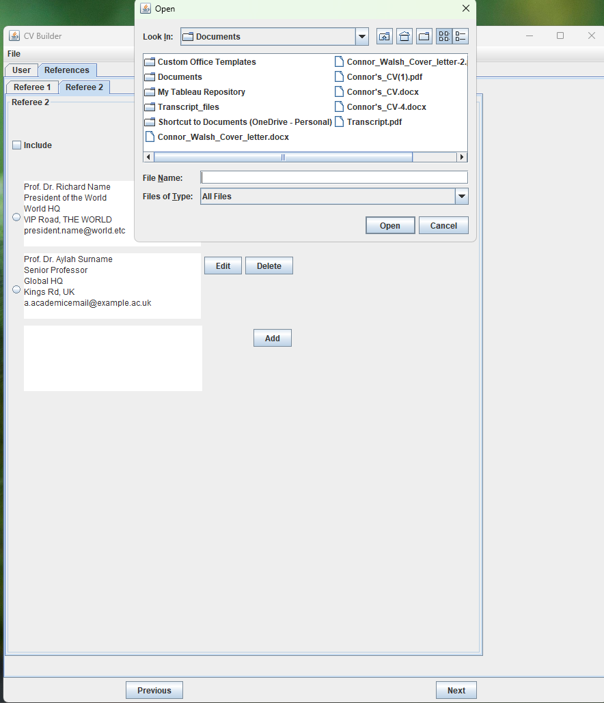

# CV_Builder

**CV_Builder** is a Java Swing-based GUI application developed as part of a university coursework project. It provides a user-friendly interface for building a structured Curriculum Vitae (CV), which is saved in a `.csv` file format. This makes it easy to open, edit, or share the CV using spreadsheet software such as Microsoft Excel or Google Sheets.

---

## 🎯 Project Overview

This project demonstrates:

- Java Swing GUI design
- Object-Oriented Programming (OOP)
- Modular, maintainable architecture
- File I/O operations (CSV format)
- Form validation and user interaction

---

## 🖥️ Features

- Tabbed GUI interface using Java Swing
- Supports multiple CV sections:
  - Personal Details (Name, Email, Title)
  - Referees (multiple entries with editing)
- Add, edit, and delete entries interactively
- Save CVs in `.csv` format via file dialog
- Input validation for required fields
- Clear navigation with “Next” and “Previous” buttons

---

## 📷 GUI Screenshots

### 👤 Name Input
.png)

### 📧 Email Entry


### 🎓 Title Selection


### 🧾 Referee Details


### ✏️ Edit Referee Dialog


### ❌ Delete Confirmation


### 📁 File Menu and Dialogs





### ⚠️ Input Validation


## 📁 Project Structure
```
CV_Builder/
├── src/
│   └── main/
│       └── java/
│           └── cvbuilder/       # Application source code
├── data/                        # Sample CSV files
├── docs/                        # Project documentation
├── screenshots/                 # GUI images for README
├── out/                         # Compiled .class files (from manual `javac` command)
├── pom.xml                      # Maven project configuration
└── README.md                    # This file
```

## 🚀 Getting Started

### 🧰 Prerequisites

- **Java Development Kit (JDK) 11** or higher  
- **Apache Maven** (for dependency management and building the project)  
- A Java IDE like **IntelliJ IDEA** or **NetBeans (This project was developed with this IDE)** (optional but recommended)

### ▶️ Running the Application

#### 1. Clone the repository:

##### For Bash and Powershell

```bash
git clone https://github.com/cWalsh-developer/CV_Builder.git
cd CV_Builder
```
#### 2. Compile and Run

##### For Bash

```bash
javac -d out $(find src -name "*.java")
java -cp out cvbuilder.App
```

##### For Powershell 

```powershell
New-Item -ItemType Directory -Force -Path out
javac -d out (Get-ChildItem -Recurse -Filter *.java | ForEach-Object { $_.FullName })
java -cp out cvbuilder.App
```
